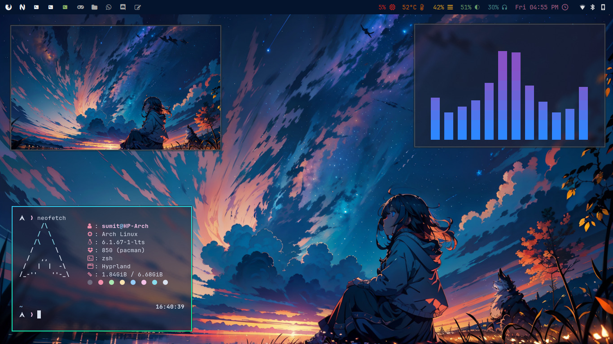

     ____   ___ _____ _____ ___ _     _____ ____
    |  _ \ / _ |_   _|  ___|_ _| |   | ____/ ___|
    | | | | | | || | | |_   | || |   |  _| \___ \
    | |_| | |_| || | |  _|  | || |___| |___ ___) |
    |____/ \___/ |_| |_|   |___|_____|_____|____/

---

## Screenshot

---



## Installation

---

Follow these steps (Beware that this will remove all your old configs. So Prepare a back-up beforehand)

>     git clone https://github.com/SwayKh/dotfiles.git
>     cd dotfiles
>     ./linkdots.sh

## What does it contain?

---

I have put the following configs in the repo

> - [Hyprland](./hypr)
> - [Waybar](./waybar)
> - [Rofi](./rofi)
> - [Kitty](./kitty)
> - [Foot](./foot)
> - [LF Config](./lf)
> - [Neovim](./nvim)
> - [Btop](./btop)
> - [Neofetch](./neofetch)
> - [Micro](./micro)
> - [Swaylock](./swaylock)
> - [Tmux](./tmux)
> - [profile](./.profile)
> - [bashrc](./.bashrc)
> - [zshrc](./.zshrc)
> - [Startship](./starship.toml)
> - [ly Config](./ly_config.ini)
> - [Scripts](https://github.com/swaykh/scripts)

There's also some configs, I've kept as backup. For eg

> - [Retroarch Config](./retroarch.cfg)
> - [Old Vim Config](./init.vim.backup)
> - [KDE shortcuts file](./kde)
> - [VS Code Settings.json](./settings.json)

### Hyprland

---

My Hyprland Configs and keybinds. I'll put the list of programs I have installed in a note to make it easier to setup or choose some alternatives to use.

### Details

---

Added useful scripts with hyprland config for Screenshots, Colorpicker, Powermenu with Rofi.

ly_config.ini - Config file for ly login manager. Place in `/etc/ly/config.ini`

Swaylock - Taken from some other reddit user. Install `swaylock-effects` to use.

kde-config - These are just shortcut configs I used with Plasma

ctpv - [ctpv](https://github.com/NikitaIvanovV/ctpv) is tool for image preview with `lf`, needs a single line config to use

### [Pokemon-colorscripts](https://github.com/nuke-dash/pokemon-colorscripts-mac) or [Shell-Color-Scripts](https://gitlab.com/dwt1/shell-color-scripts)

---

My .zshrc starts up with pokemon-colorscripts or Shell-color-scripts, So be sure to install it. Or remove it from .zshrc

```bash
git clone https://gitlab.com/phoneybadger/pokemon-colorscripts.git
cd pokemon-colorscripts
sudo ./install.sh
pokemon-colorscripts

yay -S shell-color-scripts
```

### LF File Manager

---

There is a custom LF install script that i made to install LF and setup my configs with it
You can find it in my [Scripts](https://github.com/SwayKh/Scripts) repository

Some Requirements for using LF file manager

> - Use a [Nerd Font](https://www.nerdfonts.com/)
> - Compiling [ctpv](https://github.com/NikitaIvanovV/ctpv) which my scripts automatically does for you
> - `ncdu` utility for check directory sizes

Dependencies for previews with ctpv

- ffmpegthumbnailer
- ImageMagick
- poppler
- epub-thumbnailer
- wkhtmltopdf
- chafa

For wayland Instructions check the ctpv repository
