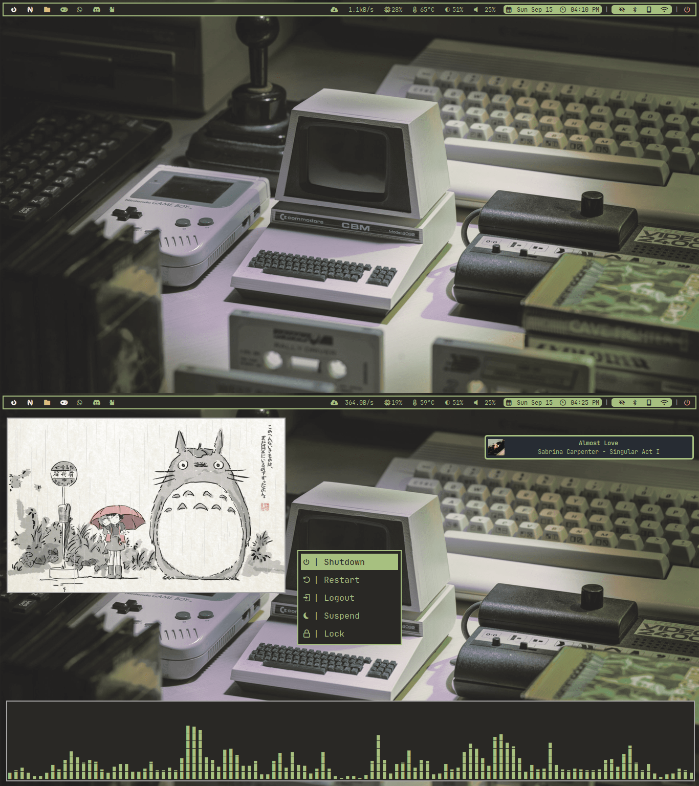
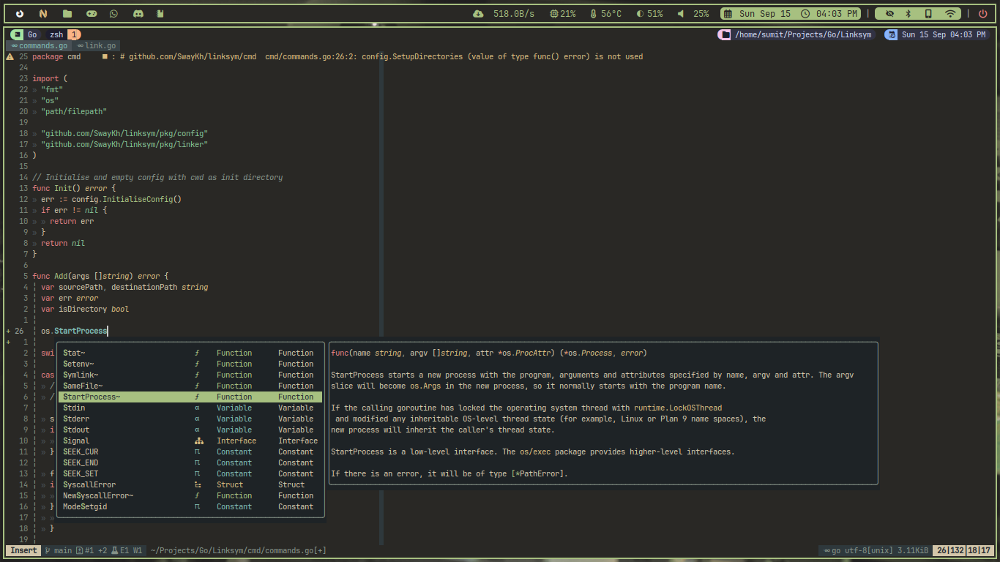

```
 ██████╗  ██████╗ ████████╗███████╗██╗██╗     ███████╗███████╗
 ██╔══██╗██╔═══██╗╚══██╔══╝██╔════╝██║██║     ██╔════╝██╔════╝
 ██║  ██║██║   ██║   ██║   █████╗  ██║██║     █████╗  ███████╗
 ██║  ██║██║   ██║   ██║   ██╔══╝  ██║██║     ██╔══╝  ╚════██║
 ██████╔╝╚██████╔╝   ██║   ██║     ██║███████╗███████╗███████║
 ╚═════╝  ╚═════╝    ╚═╝   ╚═╝     ╚═╝╚══════╝╚══════╝╚══════╝
```

---

## Screenshot

---




These are all my dotfiles, even for the software I don't use anymore. Feel free
to copy and mix and match however you like, Most of this is taken from others'
configs. Some of it might even be the defaults.

The wallpapers can be found in my [Wallpapers](https://github.com/Swaykh/wallpapers) repo.
Most of these are taken from github repos and [Unixporn](https://reddit.com/r/unixporn)

The scripts I use for setting wallpapers and the Powermenu for rofi are in the
[scripts repo](https://github.com/swaykh/scripts)

## Installation

---

Follow these steps (Beware that this will remove all your old configs. So prepare a back-up beforehand)

>     git clone https://github.com/SwayKh/dotfiles.git
>     cd dotfiles
>     ./linkdots.sh

## What Software I use

---

- **OS** : [Arch](https://archlinux.org/)
- **WM/Compositor** : [Hyprland](https://hyprland.org/)
- **Bar** : [Waybar](https://github.com/Alexays/Waybar)
- **Application Launcher** : [Rofi(wayland fork)](https://github.com/lbonn/rofi)
- **Terminal** : [Foot](https://codeberg.org/dnkl/foot)
- **File Manager** : [LF](https://github.com/gokcehan/lf)
- **Text Editor** : [Neovim](https://neovim.io/)
- **Idle daemon** : [Hypridle](https://github.com/hyprwm/hypridle)
- **Screen Locking Utility** : [Hyprlock](https://github.com/hyprwm/hyprlock)
- **Terminal Multiplexer** : [Tmux](https://github.com/tmux/tmux)
- **Shell** : [Zsh](https://www.zsh.org/)
- **Shell Prompt** : [Startship](https://starship.rs/)
- **Login Manager** : [ly](https://github.com/fairyglade/ly)
- **Wallpaper Utility** : [Swaybg](https://github.com/swaywm/swaybg)
- **System Monitor** : [Btop](https://github.com/aristocratos/btop)
- **System Info viewer** : [Neofetch](https://github.com/dylanaraps/neofetch)
- **Notification daemon** : [Dunst](https://github.com/dunst-project/dunst)
- **Screenshot**: [Grim+Slurp](https://sr.ht/~emersion/grim/)
- **Emulation Frontend** : [Retroarch](https://www.retroarch.com/) / [ES-DE](https://es-de.org/)
- **Font** : JetBrainsMono Nerd Font
- **Customization** : [Nwg-look](https://github.com/nwg-piotr/nwg-look)
  / [Qt6ct](https://github.com/trialuser02/qt6ct)
- [Scripts](https://github.com/swaykh/scripts)
- [Wallpapers](https://github.com/swaykh/wallpapers)

#### Alternatives to programs, or Xorg counterparts

- **Terminal** : [Kitty](https://sw.kovidgoyal.net/kitty/)
- **Text Editor** : [Micro](https://micro-editor.github.io/)
- **Screenlock Util** : [Swaylock-effects](https://github.com/mortie/swaylock-effects)
- **Idle daemon** : [Swayidle](https://github.com/swaywm/swayidle)
- **WM/Compositor** : [i3(X11)](https://i3wm.org/) [Sway(Wayland replacement for i3)](https://swaywm.org/)
- **Bar(For X11)** : [Polybar](https://github.com/polybar/polybar)

#### CLI Tools

```
btop
cava
eza
fzf
jq
lazygit
ncdu
tldr
paru
sshfs
swaybg
tmux
tree
```

There's also some configs, I've kept as backup. For eg

> - [Retroarch Config](./retroarch.cfg)
> - [Old Vim Config](./init.vim.backup)
> - [KDE shortcuts file](./kde)
> - [VS Code Settings.json](./settings.json)
> - [Emulation Station DE](./ES-DE)

## Hyprland

---

My Hyprland Configs and keybinds. My hyprland config is divided into various
different conf files to make it easier to navigate. I'll put the list of
programs I have installed in a note to make it easier to setup or choose some
alternatives to use.

Swaylock and Swayidle have been replaced with Hyprlock and Hypridle

## Dependencies

Dependencies for LF Preview script

```
bat
chafa
glow
wkhtmltopdf
ffmpegthumbnailer
ImageMagick
poppler
epub-thumbnailer
tar
xz
unzip
unrar
p7zip
```

Other Dependencies

```
fd (Telescope plugin neovim)
ripgrep (Telescope plugin neovim)
tumbler (For thumbnails in Thunar File Manager)
wmctrl (Window switching functionality for rofi-wayland-fork)
cliphist (Rofi as clipboard manager)
Nerd Font (https://www.nerdfonts.com/)
```
